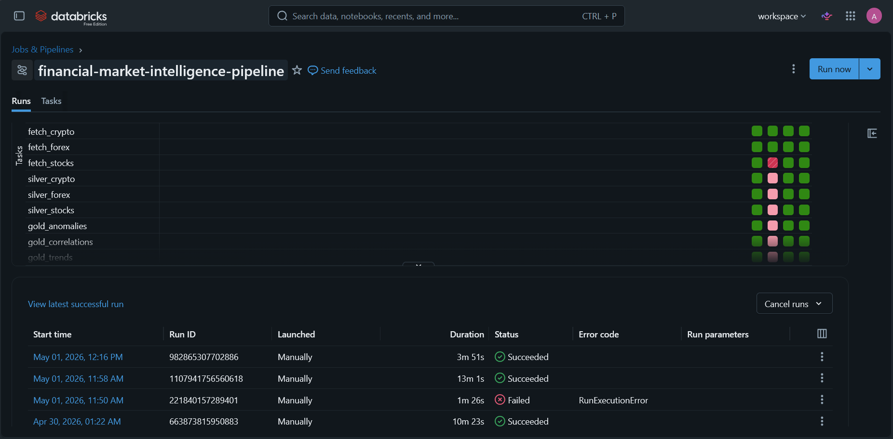
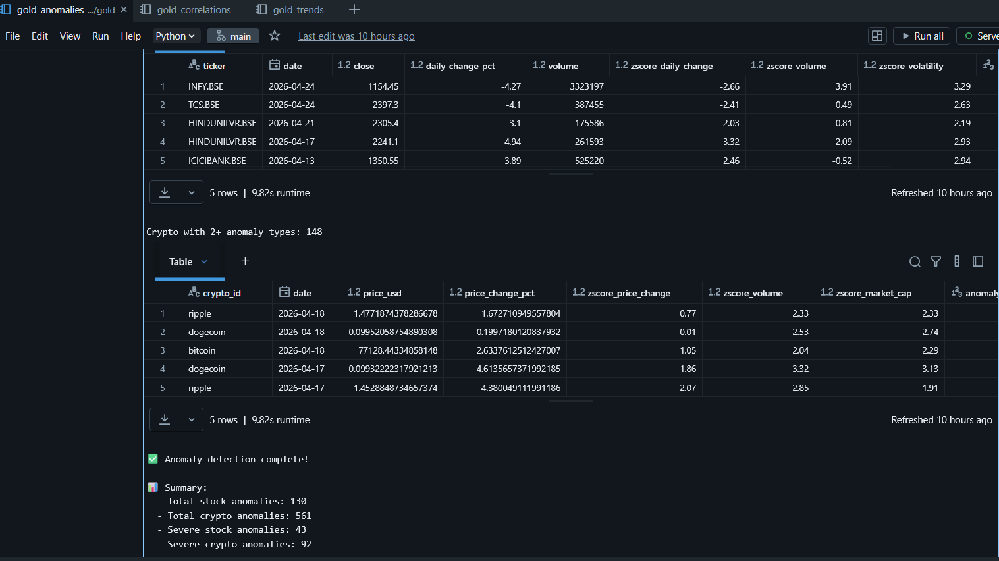
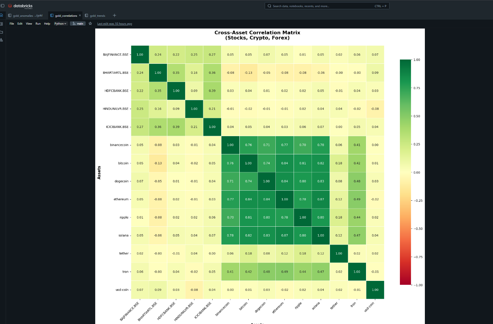

Real-time financial data pipeline with medallion 
architecture, anomaly detection, and cross-asset 
correlation analysis


---

## What This Project Does

Retail investors and fintech analysts track stocks, 
crypto, and forex across multiple fragmented platforms 
daily — spending 30-45 minutes manually aggregating data 
with no automated anomaly alerts.

This pipeline solves that. It ingests live market data 
from 3 APIs daily, processes it through a 
Bronze-Silver-Gold medallion architecture, detects 
statistical anomalies automatically, computes cross-asset 
correlations, and delivers insights through a live 
Power BI dashboard — all within 3 minutes of market close.

---

## Architecture

```
[Alpha Vantage API] ──┐
[CoinGecko API]    ──┼──► [Bronze] ──► [Silver] ──► [Gold] ──► [Power BI]
[Frankfurter API]  ──┘       ↑             ↑            ↑
                          Delta Lake    PySpark      Window
                          Raw Data      Cleaning     Functions
                               └──── Databricks Workflows ────┘
```


---

## Tech Stack

| Layer | Technology |
|---|---|
| Ingestion | Python, Requests, REST APIs |
| Processing | PySpark 4.1, Apache Spark |
| Storage | Delta Lake, Unity Catalog |
| Architecture | Bronze-Silver-Gold Medallion |
| Orchestration | Databricks Workflows |
| Visualization | Power BI |
| Version Control | GitHub |
| Platform | Databricks Community Edition |

---

## Data Sources

| API | Data | Volume | Auth |
|---|---|---|---|
| Alpha Vantage | Nifty 50 stocks OHLCV | 1,000 rows | Free key |
| CoinGecko | Top 10 crypto coins | 3,294 rows | None needed |
| Frankfurter | 10 forex pairs | 2,550 rows | None needed |
| **Total** | **All asset classes** | **6,844 rows** | |

---

## Medallion Architecture

### Bronze Layer — Raw ingestion
- Raw API responses stored as-is
- Partitioned by ticker + date
- ACID guarantees via Delta Lake
- Zero transformation — safety net for reprocessing

### Silver Layer — Cleaned data
- Null handling and type casting
- Deduplication via PySpark window functions
- Data quality validation flags
- Derived columns: daily_change_pct, price_volatility,
  inverse_rate

### Gold Layer — Analytical datasets
10 analytical tables produced:

| Table | Purpose |
|---|---|
| stocks_trends | 7/30/90-day rolling averages + signals |
| stocks_daily_summary | Market-wide daily aggregations |
| stocks_ticker_summary | Per-ticker statistics |
| stocks_anomalies | Z-score anomaly flags |
| stocks_anomaly_summary | Anomaly summary per ticker |
| crypto_anomalies | Crypto z-score anomaly flags |
| crypto_anomaly_summary | Anomaly summary per coin |
| asset_correlation_matrix | Full cross-asset correlation |
| asset_correlation_pairs | Top correlation pairs |
| asset_correlation_summary | Correlation by asset type |

---

## Key Results

```
Total records processed     →  6,844 rows
Stock anomalies detected    →  130 (43 severe)
Crypto anomalies detected   →  561 (92 severe)
ETH ↔ SOL correlation       →  0.87 (strong)
Stock ↔ Crypto correlation  →  0.013 (near zero)
Pipeline runtime            →  under 3 minutes
Pipeline schedule           →  6 PM IST, weekdays
```

---

## Engineering Decisions

**Why batch over streaming?**
NSE market closes at 3:30 PM IST daily. Real-time 
processing adds cost and complexity with no business 
benefit — batch at 6 PM gives data time to settle fully.

**Why Delta Lake over plain Parquet?**
ACID transactions prevent corrupt data on failed writes. 
Time travel enables reprocessing from any historical 
version without rebuilding the pipeline.

**Why rolling z-score over global z-score?**
Market volatility regimes change over time. A 2-year-old 
baseline is not a valid reference for today's behavior. 
30-day rolling window reflects current market conditions.

**Why Databricks Workflows over Airflow?**
Entire pipeline runs within the Databricks ecosystem — 
no cross-platform orchestration needed. Databricks 
Workflows handles scheduling, retries, dependency 
management, and alerts natively without additional 
infrastructure.

---

## Pipeline Orchestration

```
Daily at 6 PM IST — weekdays only
Cron: 5 0 18 ? * MON-FRI

fetch_stocks ──┐
fetch_crypto ──┼──► silver_stocks ──┐
fetch_forex  ──┘──► silver_crypto  ├──► gold_trends
                ──► silver_forex   ├──► gold_anomalies
                                   └──► gold_correlations

Retries: 2 per task
Retry delay: 5 minutes
Alerts: Email on success + failure
Runtime: ~3 minutes
```

---

## Power BI Dashboard

4-page live dashboard reading directly from Gold 
Delta tables:

```
Page 1 — Market Overview
  → KPI cards: instruments tracked, anomalies today
  → Line chart: 30-day price trends

Page 2 — Stock Analysis
  → Slicer: ticker selection
  → Rolling averages: 7d, 30d, 90d overlaid
  → Bullish/bearish signals

Page 3 — Anomaly Alerts
  → Anomaly leaderboard with z-scores
  → Severity classification: medium/high
  → Conditional formatting: red/orange

Page 4 — Correlation Matrix
  → Cross-asset heatmap
  → Top positive + negative correlations
  → Stock-Crypto-Forex relationship summary
```

---

## Future ML Extension

Pipeline is deliberately ML-ready:

```
Gold layer feature tables → Feature engineering
                         → Model training (XGBoost/Prophet)
                         → MLflow experiment tracking
                         → Predictions back to Gold layer
                         → Power BI predictions dashboard
```

MLflow is already built into Databricks — 
no additional setup required when ML layer is added.

---

## Project Structure

```
financial-market-intelligence/
│
├── 00_setup/
│   ├── 00_create_databases
│   └── store_key
│
├── ingestion/
│   ├── 01_fetch_stocks
│   ├── 02_fetch_crypto
│   ├── 03_fetch_forex
│   └── 04_historical_bulk_load
│
├── silver/
│   ├── 01_silver_stocks
│   ├── 02_silver_crypto
│   └── 03_silver_forex
│
├── gold/
│   ├── 01_gold_trends
│   ├── 02_gold_anomalies
│   └── 03_gold_correlations
│
├── docs/
│   ├── architecture.png
│   └── screenshots/
│
├── .gitignore
├── .env.example
├── requirements.txt
└── README.md
```

---

## Setup Instructions

**1. Clone the repo**
```bash
git clone https://github.com/aaditech001/financial-market-intelligence
```

**2. Create .env file**
```
ALPHA_VANTAGE_API_KEY=your_key_here
EXCHANGERATE_API_KEY=your_key_here
```

**3. Get free API keys**
- Alpha Vantage: alphavantage.co/support/#api-key
- ExchangeRate: exchangerate.host
- CoinGecko: No key needed

**4. Run setup notebook**
```
Databricks → 00_setup/create_databases
```

**5. Run ingestion**
```
Databricks → ingestion/fetch_stocks
```

---

## Screenshots

### Pipeline DAG


### Anomaly Detection


### Correlation Heatmap


---

## Author

**Aaditya Rathore**
B.Tech Computer Science (Data Science)
Shivalik College of Engineering, Dehradun

[](https://linkedin.com/in/aaditya-rathore-663ba9288)
[](https://github.com/aaditech001)
